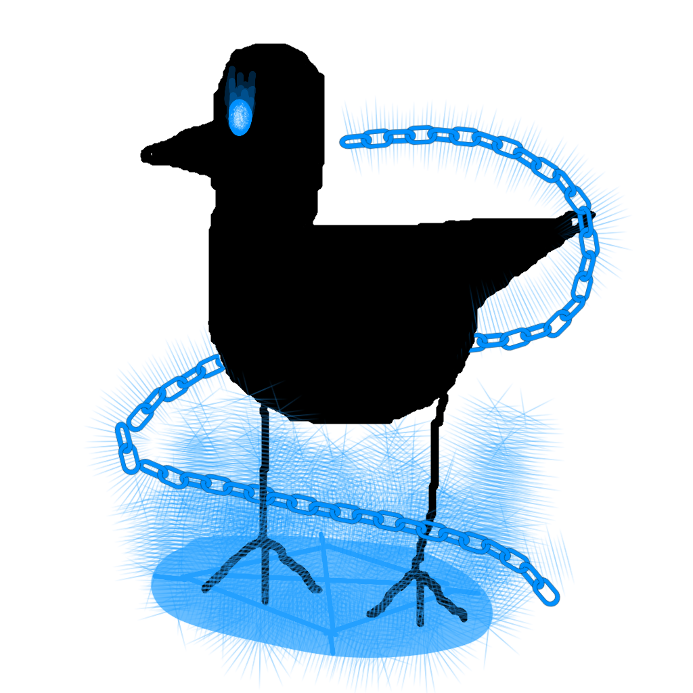

# Overview

 Omnimagical Brid is a Brid created by @Evanprice141 that was added on May 30, 2026. (Its original version was added January 18, 2026.)

# Obtainment

On the candy-cane looking structure in the Void area, there is an eight-letter code. This code is a [Pastebin link](https://pastebin.com/AwfFQGst), which when visited reads "*RHOLW]KPHKZPHLMXSZMX]IXHNJXKXIYT'4'T 'jpwoly.z'uhtl'pz'why{s 'hzzvjph{lk'~p{o'wsh nyv|uk'lx|pwtlu{5'^oh{'ht'PF'4'VTUP             Good luck.*' This is an ASCII Shift Cipher shifted -7. Shifting it up to +7 reads '*KAHEPVDIADSIAEFQLSFQVBQAGCQDQBRM - My cipher's name is partly associated with playground equipment. What am I? - OMNI*'. This is a Slidefair cipher, with the code being at the end (OMNI). Deciphering the ciphertext with the key gives you the text '*MYSTICALPOWERNINEZEROISYOURCODE*'. Typing in '*/e mysticalpower90*' in the code inputter will teleport you to the brid's subarea, where the Brid is just in front of you.

# Trivia

- This Brid's hint reads '*Supporting a candy cane-like structure..*' and its description reads '*Complete control over all things magical.*'
- This Brid is one of the first 25 Brids added to the game, being the third Brid.
- This Brid is the first Brid added to be considered 'mind-numbing', being the bare minimum difficulty for it, Extreme.
- This Brid had an original version. You can view it  Its original version also had the first part of its puzzle hidden in the console and not on the structure.
- This Brid has always been linked to Helpless Brid since Helpless Brid was added, where Helpless Brid's subarea was a branch off of Omnimagical Brid's subarea in some way.
