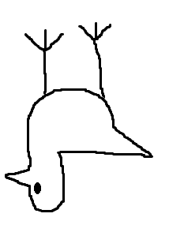

# Overview

 Upside-Down Brid is a Brid created by @crLms1n that was added on January 18, 2026.

# Obtainment

In the description of the regular Brid, there is a /e code, being '*/e verynormal*'. Typing '*verynormal*' into the code inputter teleports you under the Grassland island, where the Upside-Down Brid sits hanging upside-down from the grass above.

# Trivia

- This Brid's hint reads '*Brid's description.*' and its description reads '*He got flipped.*'
- This Brid is one of the first 25 Brids added to the game, being the fifth Brid.

