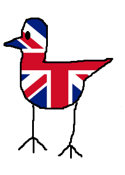

<link rel="stylesheet" href="../custom.css">
# Overview

Bridtain is a Brid created by @kajussls121 that was added on January 19, 2026.

# Obtainment

Climb up the flagpole in Grassland, the Brid should be on the right side if you're facing it from spawn.

# Trivia

- This Brid's hint reads '*On the flag.*' and its description reads '*I LOVE BRITIAN YAY'
- This Brid is one of the first 25 Brids added to the game, being the fifteenth Brid.
- This Brid used to have a different name, that being United Briddom. This was changed when the creator of the game realized that Bridtain was a much better play on words than United Briddom.

