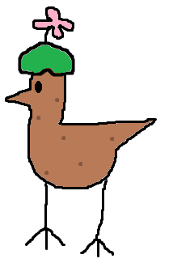

# Overview

Burrowing Brid is a Brid created by @crLms1n that was added on January 23, 2026.

# Obtainment

Next to a hill in Grassland, the flower on its head sticks out of the ground.

# Trivia

- This Brid's hint reads '*In the ground.*' and its description reads '*Burrows in the ground for fun.*'
- This Brid is one of the first 25 Brids added to the game, being the twentieth Brid.
