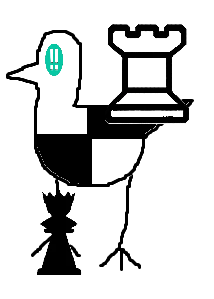

# Overview

 Chess Brid is a Brid created by @crLms1n that was added on February 1, 2026.

# Obtainment

In the Glitch realm (see entrance on its page), there is a house with a table with the words '*107932677586 chess.com*' written on it. This is a game ID for chess.com, which brings you to a game between the accounts YamikaDONN and Jude_Simpson. Under the table, there is the text '*(game-ending move#^2) x elo-w + elo-b. no commas*'. This tells you to find the move that the game ended on, square it, then multiply it by white's elo and add black's elo to the product. This gives us the equation (99^2) * 305 + 303, which equals 2,989,608. Removing the commas like said before gives us 2989608, which is the answer. Typing this code in spawns the Brid on top of the table.

# Trivia

- This Brid's hint reads '*In a house.*' and its description reads '*Extreme brilliance in every game it plays.*'

