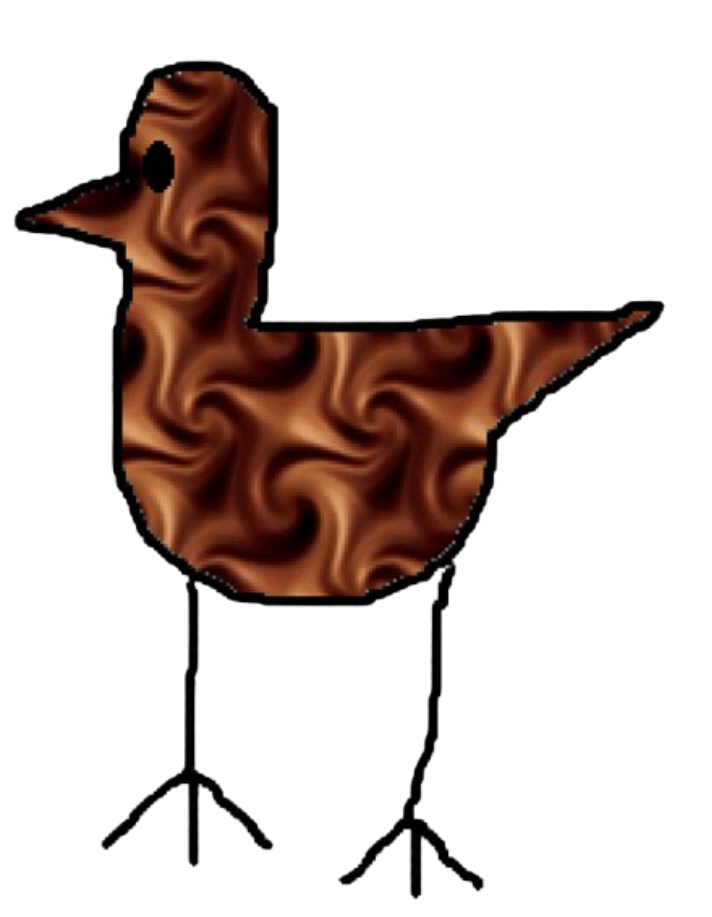

<link rel="stylesheet" href="../custom.css">
# Overview

Choco Brid is a Brid created by @LazerAmplified that was added on January 25, 2026.

# Obtainment

On the flagpole on the opposite side of Bridtain, under the far side of the path, there is Base 64-encoded text that reads '*L2UgQW50SGlsbDExOTQxOQ==*'. Decoding this gives you the code '*/e AntHill119419*'. Enter this code takes you the Choco Brid's subarea, where you have to do a small amount of obbying to reach the Brid.

# Trivia

- This Brid's hint reads '*The flag.*' and its description reads '*Made from chocolate, or is it from the ant hill substance?*'
- This Brid is one of the first 25 Brids added to the game, being the twenty-third Brid.
- Troll Brid's subarea copies this Brid's subarea.
