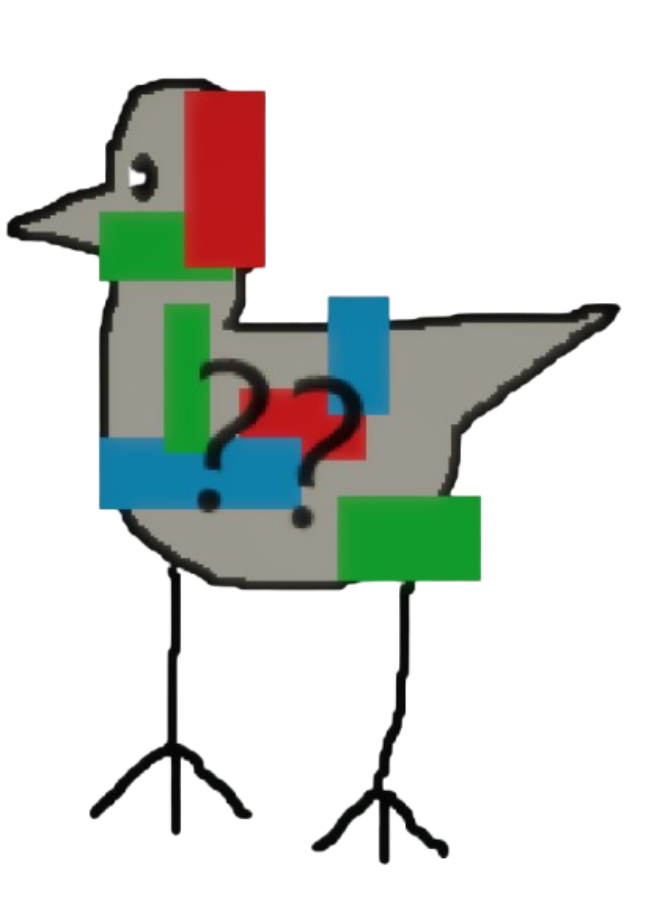

# Overview

Glitch Brid is a Brid created by @LazerAmplified that was added on January 20, 2026.

# Obtainment

In the Glitch realm (see entrance on its page), go on top of the map, enable sprint and jump onto the floating RGB-colored bundle closest to spawn. It should be on the far side of the blue-colored part.

# Trivia

- This Brid's hint reads '*Up in the sky.*' and its description reads '*L̸̨̡̥̥̽̆͑̆o̷͉̻͇̬̿̔̚r̴̢̥̗͓̆̏ĕ̵̡̞̦̤m̶̠̳̩̽͝ ̵͖̙͇͇̓̍͂i̸̫̜̱̔p̵̰͎͙̹̒͠s̶̟̊ú̴̡̙͎m̸̡͕̭͆̏̏'
- This Brid is one of the first 25 Brids added to the game, being the seventeenth Brid.
- This Brid is the first Brid to be added to a subrealm. This, however, was not always the case. When the Glitch realm was only a subarea, Glitch Brid was one of the two Brids added before it was changed to a realm.
