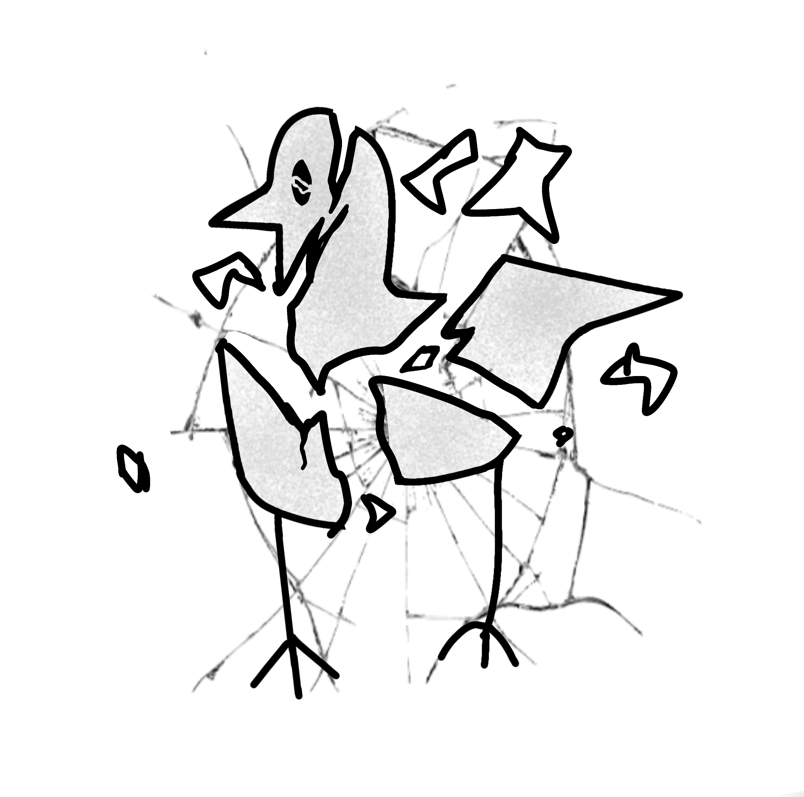

# Overview

 Shattered Glass Brid is a Brid created by @Evanprice141 that was added on April 15, 2026, to replace the original version made by @crLms1n that was added on February 3, 2026.

# Obtainment

In the Toilet subarea, there is a platform below the hole to exit the toilet. Climb on it, shiftlock through the first gap, and fling yourself off of the second onto an inner truss, then truss bounce backwards into the neon part. From there, there is text that reads '*Good luck. Start at A. 11, 0, 11, 12, 5, 16, 11, 8, 22, 8, 17, 13, 24, 15, 9, 2, 8, 20, 25. All caps.*' This is not referencing a direct A1Z26 cipher, but rather a Caesar shift. Shift A over 11 spots, you get L. Shift it over 0 spots, it stays at L. Sift it over 11 spots, and you get W. Repeat this step for each number, and you get the text '*ALLWINDOWSARECRACKED*'. Entering this code will teleport you to the other side of the wall, where you will then have to perform a precise fall down below to get the Brid.

# Trivia

- This Brid's hint reads '*Somewhere you'd never want to find a window.*' and its description reads '*A ruined mosaic artpiece.*'
- This Brid used to be Impossible (today Metaphysical) difficulty before Classic Brid was made to take its place.

